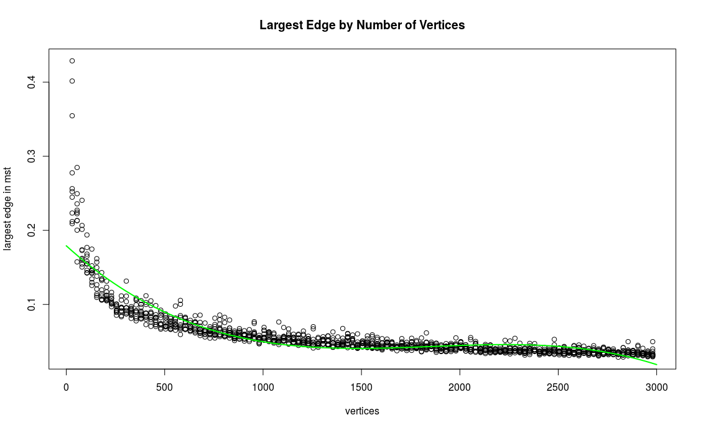

MST
===

Finding the MST of a complete graph

```R
Call:
lm(formula = y ~ poly(x, 3, raw = TRUE), data = d)

Residuals:
      Min        1Q    Median        3Q       Max
-0.040845 -0.007238 -0.000260  0.005428  0.256759

Coefficients:
                          Estimate Std. Error t value Pr(>|t|)    
(Intercept)              1.791e-01  2.170e-03   82.56   <2e-16 ***
poly(x, 3, raw = TRUE)1 -2.401e-04  6.206e-06  -38.70   <2e-16 ***
poly(x, 3, raw = TRUE)2  1.349e-07  4.776e-09   28.24   <2e-16 ***
poly(x, 3, raw = TRUE)3 -2.421e-11  1.043e-12  -23.20   <2e-16 ***
---
Signif. codes:  0 ‘***’ 0.001 ‘**’ 0.01 ‘*’ 0.05 ‘.’ 0.1 ‘ ’ 1

Residual standard error: 0.0179 on 1186 degrees of freedom
Multiple R-squared:  0.7798,	Adjusted R-squared:  0.7793
F-statistic:  1400 on 3 and 1186 DF,  p-value: < 2.2e-16
```


